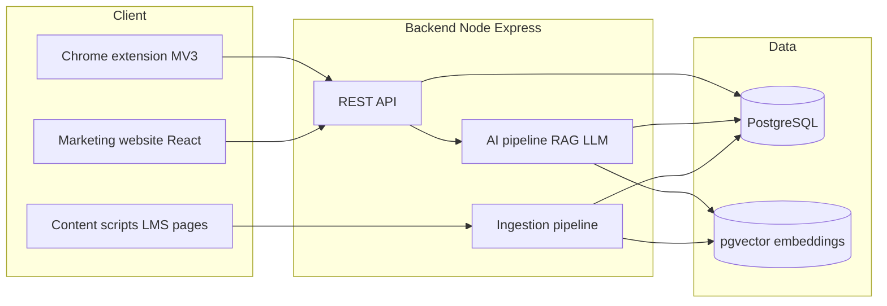

# Architecture — AI Companion Study Flow

This document describes the **intended end-to-end system**: website, Chrome extension, backend, data, and AI. Only the **website** in this repository is implemented today; the rest is the **target design** aligned with your stack and wireframes.

---

## 1. High-level picture

- **Website:** onboarding, account, link to Chrome Web Store / install instructions.
- **Extension:** side panel UI (Ask, Quiz, hub, settings); optional content scripts on LMS tabs for **passive ingestion** and context.
- **Backend:** one API surface for auth (JWT), ingestion jobs, chat/explain/quiz, and misconception updates.
- **PostgreSQL + pgvector:** structured user/course data + embedding similarity for retrieval.

---

## 2. Repository layout (current vs planned)

| Area | Status | Notes |
|------|--------|--------|
| `src/` React SPA | **Implemented** | Routes: `/`, `/download`, `/login`, `/signup`, `/welcome`. |
| Chrome extension (`extension/` or monorepo package) | **Planned** | `manifest.json` (MV3), service worker, side panel entry, content scripts. |
| Node + Express API | **Planned** | Auth, ingestion, RAG, quiz generation. |
| PostgreSQL + pgvector | **Planned** | App data + vectors. |

---

## 3. Website pages and responsibilities

| Route | Responsibility |
|-------|----------------|
| **Home `/`** | Explain value: in-flow capture, structured help, course-aware RAG, misconception graph; CTAs to download and sign up. |
| **Download `/download`** | Single place for “Get the extension”: Chrome Web Store URL or developer instructions (Load unpacked). |
| **Login `/login`** | Collect credentials; later POST to `/auth/login`, store JWT (httpOnly cookie or secure storage pattern you choose). |
| **Sign up `/signup`** | Registration; later POST to `/auth/register`. |
| **Welcome `/welcome`** | Post-login landing; can deep-link to extension install or OAuth (Canvas/Brightspace) setup on the backend. |

The website does **not** host Ask/Quiz UI; that lives in the **extension side panel** for contextual, always-available assistance while browsing notes and problems.

---

## 4. Chrome extension architecture (target)

### 4.1 Why it’s not “the same” as the website

- The extension must ship **Manifest V3** assets: **background service worker**, optional **content scripts**, **side_panel** (and/or `action` popup), **permissions** (`storage`, `sidePanel`, host permissions for LMS domains).
- Build output is a **loaded unpacked folder** or **Chrome Web Store package**, not the same `index.html` host as Vite unless you embed the panel in an extension-only bundle.

**Recommended organization:** same git repo, second package:

- `apps/web` — this Vite site (or keep root as today).
- `apps/extension` — extension build, may reuse React for the panel via a second Vite config or a shared component library.

### 4.2 “Pop ups on the side” → Side Panel API

Chrome’s **Side Panel** API gives a **vertical panel** docked beside the page — this matches “assistant beside the document” better than a small toolbar popup. You can still use a **popup** for quick actions, but **Ask mode**, **Quiz mode**, and **chat-style threads** are usually **routes or tabs inside the side panel** (one React app, multiple views).

### 4.3 Operating modes (from your product spec)

| Mode | Behavior |
|------|----------|
| **Passive ingestion** | Content script (on allowlisted LMS URLs such as Brightspace) extracts or signals new/updated materials; backend chunks, embeds, writes to pgvector. Runs without opening the panel. |
| **Active assistant** | User opens side panel: **Hub** → **Ask/capture** (structured explanation + RAG) or **Quiz** (lecture selection → MCQ → results + misconception updates). |

### 4.4 Ask vs Quiz vs “chat”

- **Ask / capture:** one-shot or short thread; server retrieves lecture chunks, returns structured blocks (question, solution, main concept, relevant lecture).
- **Quiz:** separate flow: select lectures → generated questions → score + history + share stats.
- **Chat mode:** can be **the same panel** with a conversational layout; still **RAG + LLM** on the backend, with session state in Postgres. It is **not** a separate product — it’s a **UI mode** unless you intentionally split mobile/web chat later.

---

## 5. Backend subsystems (target)

### 5.1 Ingestion pipeline

- Accept course materials (files, LMS API where available, or processed exports).
- **Chunk** text, **embed** (e.g. OpenAI `text-embedding-3-small` or later Gemma/other).
- Store in **PostgreSQL** + **pgvector**; link chunks to course, lecture, user.

### 5.2 AI pipeline

- **Retrieve** relevant chunks (similarity search + filters).
- **Gemini** (e.g. `gemini-2.x` / your chosen model) for explanation, quiz generation, **misconception classification**.
- Persist interactions to improve **misconception graph** and spaced repetition.

### 5.3 Auth

- **JWT** for sessions after login.
- **OAuth 2.0** for LMS (Canvas is common; **Brightspace/D2L** may use institution-specific OAuth/LTI — implement what your school/API access allows).

### 5.4 OCR

- **Google Cloud Vision** on the server for screenshots/handwriting sent from the extension or uploaded assets.

---

## 6. Brightspace / LMS context

- **Extension alone** cannot magically read all Brightspace course content without permissions and APIs.
- Typical patterns:
  - **Backend OAuth** to LMS where the institution exposes APIs.
  - **User-uploaded** syllabi/PDFs/PowerPoints to ingestion.
  - **Content scripts** limited to **helper** behavior (e.g. detecting you’re on a lesson page and suggesting “add to corpus”) combined with **server-side** fetching if your app is registered with the LMS.

Course ingestion details are **policy- and school-dependent**; the architecture assumes **your backend** is the source of truth for vectors and lecture links shown in the panel.

---

## 7. Tech stack reference

| Layer | Technology |
|-------|------------|
| Website | React, Vite, TypeScript, React Router |
| Extension | Manifest V3, service worker, content scripts, Side Panel (planned) |
| Backend | Node.js, Express (planned) |
| Database | PostgreSQL + **pgvector** (planned) |
| LLM | Gemini API (explain, quiz, classification) (planned) |
| Embeddings | OpenAI embeddings (or successor) (planned) |
| OCR | Google Cloud Vision (planned) |
| Auth | JWT + OAuth for LMS (planned) |
| Hosting | Railway or Render for API (planned) |

---

## 8. Summary

- **This repo:** the **public website** and developer workflow (`npm run dev`, `npm run build`).
- **Extension:** **separate build**, ideally **same monorepo**, same API — side panel hosts Ask, Quiz, and optional chat UI; content scripts support ingestion on LMS pages.
- **Brightspace/course context:** owned by **backend ingestion + RAG**, not by the static site.

For day-to-day development, implement the **extension package** next, point **Download** to the store or unpacked path, and add the **Express + Postgres** service when you’re ready to persist users and vectors.
